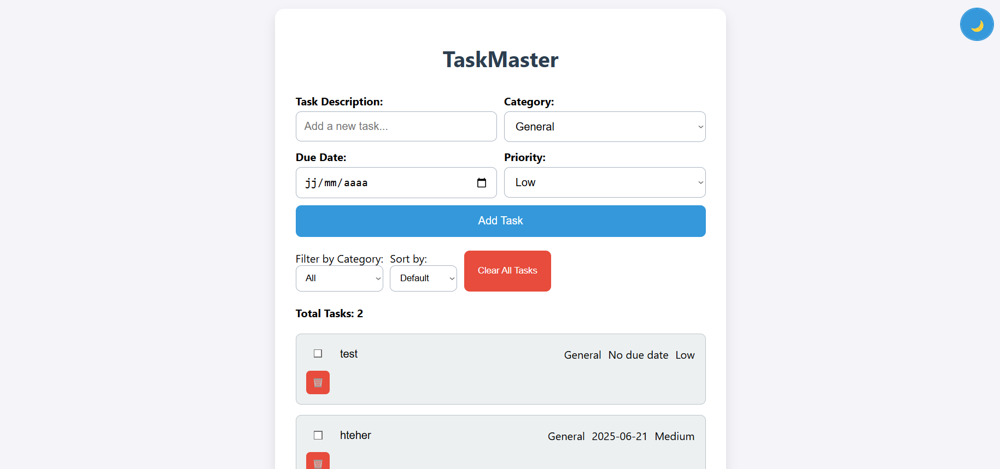

# TaskMaster

TaskMaster is a modern to-do list application designed to help you manage tasks efficiently. With features like task categorization, due dates, priority levels, filtering, sorting, and a persistent dark mode, TaskMaster keeps you organized. Tasks are saved in your browser’s local storage for seamless persistence.



## Features

- Add, edit, and delete tasks with confirmation prompts
- Categorize tasks (General, Work, Personal, Urgent)
- Set due dates and assign priority levels (Low, Medium, High)
- Filter tasks by category and sort by due date or priority
- Clear all tasks with confirmation
- Toggle dark mode with persistent state
- Persistent task data using `localStorage`
- Accessible interface with keyboard support and ARIA attributes
- Input validation with error messages

## Demo

Try TaskMaster at [https://your-demo-url.com](https://your-demo-url.com/).

## Prerequisites

- A modern web browser (e.g., Google Chrome, Mozilla Firefox, Microsoft Edge)
- No external dependencies required

## Installation

1. Clone the repository:
    
    ```bash
    git clone https://github.com/your-username/taskmaster.git
    ```
    
2. Navigate to the project directory:
    
    ```bash
    cd taskmaster
    ```
    
3. Open `index.html` in a browser or serve it using a local server (e.g., `npx live-server`).

## Usage

1. **Add a Task**: Enter a task description, select a category, set a due date (optional), choose a priority, and click "Add Task" or press Enter.
2. **Edit a Task**: Double-click the task text to edit, then press Enter or click away to save.
3. **Mark as Complete**: Check the box to mark a task as complete (adds a strikethrough).
4. **Delete a Task**: Click the trash icon (🗑️) and confirm to delete.
5. **Filter Tasks**: Use the "Filter by Category" dropdown to show specific categories.
6. **Sort Tasks**: Use the "Sort by" dropdown to order tasks by due date or priority.
7. **Clear All Tasks**: Click "Clear All Tasks" and confirm to remove all tasks.
8. **Toggle Dark Mode**: Click the moon (🌙) or sun (☀️) icon (top-right) to switch themes.

## Development

To develop TaskMaster:

1. Follow the [Installation](https://grok.com/chat/444b6c84-b5ad-4490-99fd-9af135bab264#installation) steps.
2. Edit `index.html`, `styles.css`, or `script.js`.
3. Test changes in a browser.
4. Ensure compatibility with modern browsers and verify accessibility.

**Testing**:

- Manually test task creation, editing, deletion, filtering, sorting, and dark mode.
- Check accessibility using screen readers (e.g., NVDA, VoiceOver).
- Verify `localStorage` persistence across page reloads.

## Contributing

Contributions are welcome! To contribute:

1. Fork the repository.
2. Create a branch (`git checkout -b feature/your-feature`).
3. Commit changes (`git commit -m "Add your feature"`).
4. Push to the branch (`git push origin feature/your-feature`).
5. Open a pull request.

Discuss major changes via an issue first. Follow the existing code style and test your changes.

## License

MIT License

Copyright (c) 2025 [Your Name]

See the [LICENSE](https://grok.com/chat/LICENSE) file for details.

## Contact

For questions, contact [Your Name] via [[email@example.com](mailto:email@example.com)] or [GitHub](https://github.com/your-username).

## Acknowledgments

Inspired by task management tools like Todoist and Microsoft To Do.